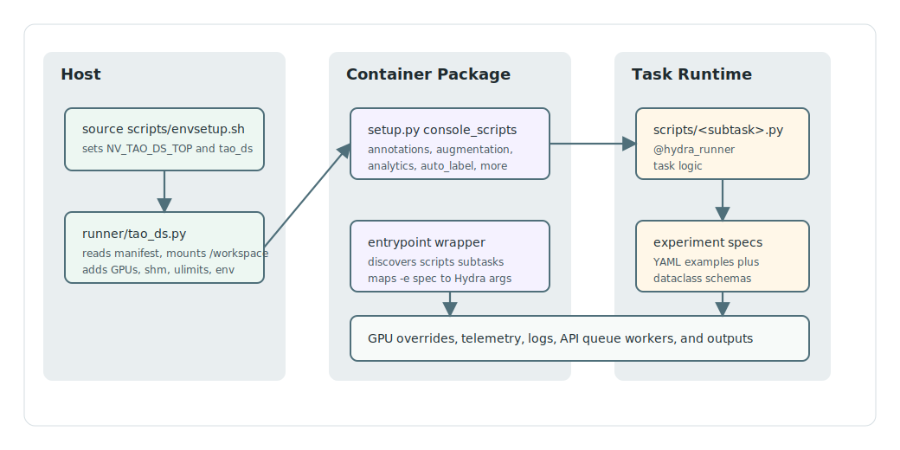

# Architecture

TAO Data Services is a source package plus a Dockerized runtime. Host users
enter through `tao_ds`; in-container users enter through package console scripts.

## Runtime Dispatch

1. `source scripts/envsetup.sh` exports `NV_TAO_DS_TOP` and defines `tao_ds`.
2. `tao_ds` runs `runner/tao_ds.py`, resolves the base image from
   `docker/manifest.json`, mounts the repository as `/workspace`, sets
   `PYTHONPATH=/workspace:$PYTHONPATH`, and starts Docker with the requested
   GPUs, mounts, environment variables, shared memory, ulimits, UID/GID, and
   optional service-mode ports.
3. Commands after `tao_ds --` execute inside the container.
4. `setup.py` installs package commands for data-service domains.
5. Standard commands call `nvidia_tao_ds/core/entrypoint/entrypoint.py`, which
   discovers subtask modules from each package's `scripts/` directory, validates
   `-e/--experiment_spec_file`, injects `--config-path` and `--config-name`, and
   launches the selected Python script.
6. Script modules use `nvidia_tao_ds/core/hydra/hydra_runner.py` to run Hydra,
   disable `.hydra` output directories, register optional dataclass schemas, and
   preserve stdout-oriented logging.

## Command Families

| Command | Package | Dispatch Pattern |
| :--- | :--- | :--- |
| `augmentation` | `nvidia_tao_ds/augmentation` | Shared launcher with `-e`; MPI path for multi-GPU `generate`. |
| `auto_label` | `nvidia_tao_ds/auto_label` | Shared launcher with `-e`; `torchrun` path for multi-GPU `generate`. |
| `annotations` | `nvidia_tao_ds/annotations` | Shared launcher with `convert`, `merge`, `slice`, and QA conversion subtasks. |
| `analytics` | `nvidia_tao_ds/data_analytics` | Shared launcher; config package is named `analytics`. |
| `image` | `nvidia_tao_ds/image` | Shared launcher for image validation. |
| `embedding` | `nvidia_tao_ds/mining/embedding` | Direct dispatcher that forwards Hydra args to `image_embeddings`. |
| `tmm` | `nvidia_tao_ds/mining/tmm` | Direct dispatcher that forwards Hydra args to `nearest_neighbors`. |
| `gap_analysis` | `nvidia_tao_ds/rcca/gap_analysis` | Direct dispatcher for `vcn_aoi` and `vlm_bcq`. |

`get_subtasks()` also wires a shared `default_specs` helper. Before documenting
or relying on that helper for a domain, check
`nvidia_tao_ds/core/utils/default_specs.py` and the matching
`nvidia_tao_ds/config/` layout; nested domains such as mining and RCCA do not
follow the same flat module pattern as `annotations` or `augmentation`.

## Configuration Flow

Most command scripts combine three files:

| Layer | Example | Purpose |
| :--- | :--- | :--- |
| Entrypoint wrapper | `nvidia_tao_ds/annotations/entrypoint/annotations.py` | Parses the subtask and delegates to the shared launcher. |
| Script subtask | `nvidia_tao_ds/annotations/scripts/convert.py` | Owns task logic and the `@hydra_runner(...)` declaration. |
| Experiment spec | `nvidia_tao_ds/annotations/experiment_specs/annotations.yaml` | Example YAML selected by `-e` or direct Hydra overrides. |
| Dataclass schema | `nvidia_tao_ds/config/annotations/default_config.py` | Structured defaults and schema used by Hydra/API/default-spec generation. |

Do not infer spec names from subtask names. The source of truth is each
script's `@hydra_runner(config_name=...)`. For example, the `annotations`
`convert` subtask uses `config_name="annotations"`, while `qa_to_llava_annotation`
uses `config_name="qa_to_llava"`.

## Shared Services

| Module | Responsibility |
| :--- | :--- |
| `nvidia_tao_ds/core/entrypoint/entrypoint.py` | Subtask discovery, spec path conversion, GPU override precedence, process launch, telemetry, and log teeing. |
| `nvidia_tao_ds/core/hydra/hydra_runner.py` | Local wrapper around Hydra's internal runner with schema registration and TAO-friendly logging overrides. |
| `nvidia_tao_ds/core/utils/default_specs.py` | Default experiment YAML generation from dataclass configs. |
| `nvidia_tao_ds/core/logging/` | TAO Data Services logging helpers. |
| `nvidia_tao_ds/core/llm_clients/` | OpenAI-compatible, Gemini, and base LLM client abstractions used by auto-label workflows. |

## API Service

`nvidia_tao_ds/api/app.py` is a Flask application with OpenAPI endpoints under
`/api/v1`. It exposes neural-network action discovery, schema lookup, action
submission, job status, health, OpenAPI JSON/YAML, Swagger, and Redoc routes.

The API uses `nvidia_tao_core.api_utils.module_utils` to map installed console
scripts to actions, `dataclass2json_converter` for schema materialization, and
`json_schema_validation` before queueing jobs. A background thread processes the
shared `process_queue`. Service-mode container launch is handled by
`runner/tao_ds.py --run_as_service`.

## Extension Points

Add a new workflow by choosing the smallest surface:

| Change | Typical Files |
| :--- | :--- |
| New subtask in an existing command | `nvidia_tao_ds/$DOMAIN/scripts/$SUBTASK.py`, `experiment_specs/`, `config/`, tests. |
| New top-level command | New package with `entrypoint/`, `scripts/`, `experiment_specs/`, config package, `setup.py` entry, tests, README generator update. |
| New API-visible action | Command/config support plus `api/app.py` and any `tao-core` module utility mapping changes. |
| New container dependency | `docker/requirements-pip.txt`, `docker/Dockerfile`, `docker/build.sh`, `docker/manifest.json` after push. |

Use [new_data_service_command.md](new_data_service_command.md) before adding a
new command or promoting a pattern as canonical.
