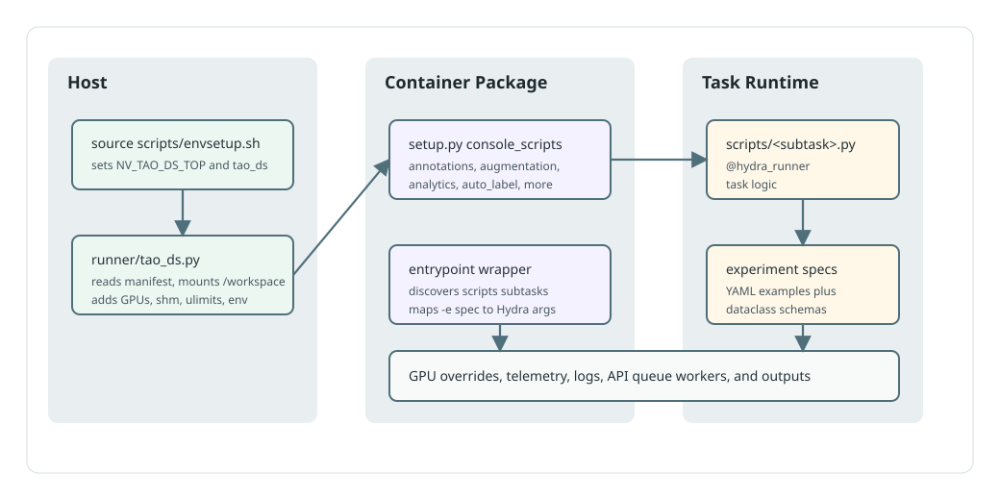
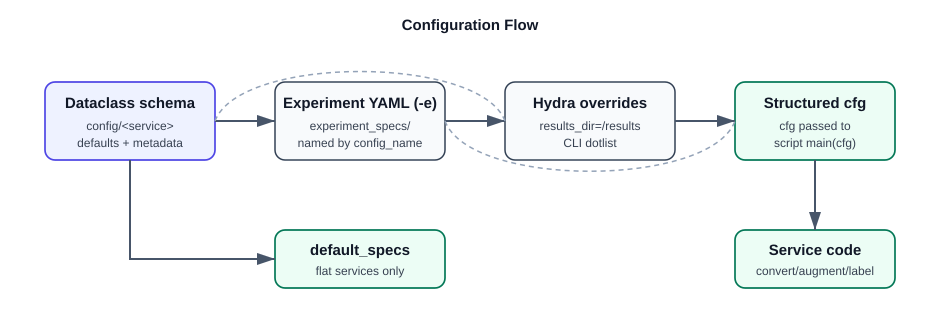

# Architecture

This guide explains what TAO Data Services is, how customers run it, and how a
command flows through the source code. For a directory-level orientation, read
the [Codebase tour](codebase_tour.md) first.

## What TAO Data Services Is

TAO Data Services is the dataset-preparation backend of the TAO ecosystem: a
set of GPU-accelerated services for annotation conversion, data augmentation,
auto-labeling, dataset analytics, data mining, and model-gap analysis. This
repository is its source. It ships to users as one container,
`nvcr.io/nvidia/tao/tao-toolkit:<version>-dataservices`, alongside the sibling
backends built from tao-pytorch (training) and tao-deploy (TensorRT inference).

The product surface is the set of console commands this package installs
(`annotations`, `augmentation`, `auto_label`, `analytics`, `image`,
`embedding`, `tmm`, `gap_analysis`) plus their subtasks. Everything else in
this repository exists to build, validate, or develop that container.

## How Users Run Data Services

As of TAO 7.0 there is one supported user surface, with the container CLI
underneath it:

1. **Agent and TAO skills (current).** Users load the `tao-skills` plugin in a
   coding agent and ask for the outcome ("convert these COCO annotations to
   KITTI"). The skills and the TAO Execution SDK dispatch a job to the user's
   compute backend (local Docker, DGX Cloud Lepton, Brev, SLURM, or
   Kubernetes), which runs the data-services container and invokes the same
   console commands documented here.
2. **Container CLI (the layer underneath).** Inside the
   `<version>-dataservices` container, users or automation run the commands
   directly: `annotations convert -e spec.yaml`, `embedding image_embeddings
   -e spec.yaml`, and so on. The public data-mining and auto-label
   documentation shows this form.

Two older surfaces were **removed in TAO 7.0** and should not appear in new
code or documentation: the **TAO Launcher** (`tao dataset annotations convert
...`, deprecated in 6.0) and **FTMS** (the Fine-Tuning MicroService REST API
plus the `nvidia-tao-client` CLI/SDK). This repository still contains
FTMS-era code paths (`nvidia_tao_ds/api/`, the microservice `CMD` in the
release Dockerfile, `JOB_ID`-gated log teeing); treat them as legacy
integration surfaces, not as the way users run the product.

## Terminology

| Term | Meaning here |
| :--- | :--- |
| Service | One dataset-preparation domain with its own console command and package, such as `annotations` or `augmentation`. Also called a command family. |
| Subtask | One operation of a service, implemented as one module in the service's `scripts/` package and selected as the first CLI argument: `annotations convert`, `analytics analyze`. |
| Specification (spec) | The YAML experiment file passed with `-e`, validated against the service's dataclass schema. |
| Shared command dispatcher | `nvidia_tao_ds/core/entrypoint/entrypoint.py` — the in-repo code every console command delegates to. Not a product. |
| `tao_ds` | The **development-only** container launcher defined by `scripts/envsetup.sh` (a shell function over `runner/tao_ds.py`). Users never see it; public docs reuse the name as a nickname for the data-services container itself. |
| TAO Launcher | The removed `tao` CLI product (deprecated 6.0, removed 7.0). Not related to `tao_ds` or to the dispatcher above. |
| FTMS | The removed Fine-Tuning MicroService REST API and `nvidia-tao-client`. Its in-repo remnants are noted above. |

## Developer Runtime: From Console Command to Script



For development, `tao_ds` (dev-only, see Terminology) stands in for whatever
runs the container in production:

1. `source scripts/envsetup.sh` exports `NV_TAO_DS_TOP` and defines `tao_ds`.
2. `tao_ds` runs `runner/tao_ds.py`, resolves the base image from
   `docker/manifest.json`, mounts the repository as `/workspace`, and starts
   Docker with the requested GPUs, mounts, environment variables, shared
   memory, ulimits, UID/GID, and optional service-mode ports.
3. Commands after `tao_ds --` execute inside the container.

From here on the flow is identical for users and developers:

4. `setup.py` installs one console script per service (`annotations`,
   `augmentation`, `auto_label`, `analytics`, `image`, `embedding`, `tmm`,
   `gap_analysis`).
5. Every console script is a thin argparse shell over the shared command
   dispatcher in `nvidia_tao_ds/core/entrypoint/entrypoint.py`, which:
   * Discovers subtask modules from the service's `scripts/` package and
     injects the synthetic `default_specs` subtask.
   * Validates `-e/--experiment_spec_file` and converts it into Hydra
     `--config-path`/`--config-name` flags, passing unknown CLI tokens through
     as Hydra overrides.
   * Applies multi-GPU settings only for subtasks in `multigpu_support`
     (default: `['generate']`) and, when more than one GPU is requested,
     selects the runner: `mpirun` for `augmentation`, `torchrun` for
     `auto_label`, and plain `python` otherwise.
   * Spawns the selected script as a **fresh Python subprocess**, streaming
     stdout (and to `$TAO_MICROSERVICES_TTY_LOG/$JOB_ID/microservices_log.txt`
     when `JOB_ID` is set).
   * Reports telemetry and determines success from **both** the exit code and
     the last record of `results_dir/status.json`.
6. Script modules use `nvidia_tao_ds/core/hydra/hydra_runner.py` to register
   the dataclass schema and run Hydra, and `@monitor_status` from
   `core/decorators.py` to create the results directory, write `status.json`,
   and map exceptions to user-facing status messages.

## Command Families

| Command | Package | Dispatch pattern | Compute |
| :--- | :--- | :--- | :--- |
| `annotations` | `nvidia_tao_ds/annotations` | Shared dispatcher: `convert`, `merge`, `slice`, `qa_to_llava_annotation`. | CPU |
| `augmentation` | `nvidia_tao_ds/augmentation` | Shared dispatcher; DALI pipelines; MPI path for multi-GPU `generate`. | GPU |
| `auto_label` | `nvidia_tao_ds/auto_label` | Shared dispatcher; `torchrun` path for multi-GPU `generate`; fans out on `autolabel_type`. | GPU or remote LLM |
| `analytics` | `nvidia_tao_ds/data_analytics` | Shared dispatcher: `analyze`, `validate`, `kpi_analyze`. Config package is named `analytics`. | CPU |
| `image` | `nvidia_tao_ds/image` | Shared dispatcher: `validate` (corrupted-image removal). | CPU |
| `embedding` | `nvidia_tao_ds/mining/embedding` | Shared dispatcher: `image_embeddings`, `text_embeddings` (CLIP and SigLIP to Parquet). | GPU |
| `tmm` | `nvidia_tao_ds/mining/tmm` | Shared dispatcher: `nearest_neighbors`, `unique_neighbor_matching` (RAPIDS). | GPU |
| `gap_analysis` | `nvidia_tao_ds/rcca/gap_analysis` | Shared dispatcher: `object_detection`, `vcn_aoi`, `vlm_bcq`. | CPU |

`get_subtasks()` wires a shared `default_specs` helper into every command, but
it only works for the flat services (`annotations`, `augmentation`,
`auto_label`, `image`, `analytics`); `nvidia_tao_ds/core/utils/default_specs.py` does not support the nested
mining and RCCA domains.

## Configuration Flow



Most command scripts combine four pieces:

| Layer | Example | Purpose |
| :--- | :--- | :--- |
| Entrypoint wrapper | `nvidia_tao_ds/annotations/entrypoint/annotations.py` | Parses the subtask and delegates to the shared dispatcher. |
| Script subtask | `nvidia_tao_ds/annotations/scripts/convert.py` | Owns task logic and the `@hydra_runner(...)` declaration. |
| Experiment spec | `nvidia_tao_ds/annotations/experiment_specs/annotations.yaml` | Example YAML selected by `-e` or direct Hydra overrides. |
| Dataclass schema | `nvidia_tao_ds/config/annotations/default_config.py` | Structured defaults and schema used by Hydra, the API, and default-spec generation. |

The configuration precedence at runtime is:

```text
dataclass defaults -> experiment YAML (-e) -> command-line Hydra overrides
```

Two schema conventions coexist:

* **Flat services** keep their schemas in `config/<service>/`, anchored by a
  `default_config.py::ExperimentConfig`. Subtasks may add sibling modules:
  `annotations` pairs `ExperimentConfig` (convert) with `merge_config.py` and
  `slice_config.py`, while `qa_to_llava_annotation` defines its configuration
  inline in the script.
* **Newer nested services** (mining, rcca) define one configuration module per
  subtask, named after the subtask (for example,
  `config/mining/tmm/nearest_neighbors.py::NearestNeighborsConfig`).

Schemas declare their fields through typed factories from `config/utils/types.py`
(`STR_FIELD`, `INT_FIELD`, `FLOAT_FIELD`, `BOOL_FIELD`, `LIST_FIELD`,
`DICT_FIELD`, `DATACLASS_FIELD`, ...). Each factory attaches metadata —
`description`, `display_name`, `valid_options`, `valid_min`/`valid_max`,
`default_value`, and `automl_enabled`) consumed by the API schema layer and
default-specification generation.

Do not infer specification names from subtask names. The source of truth is each
script's `@hydra_runner(config_name=...)`. For example, `annotations convert`
uses `config_name="annotations"`, `qa_to_llava_annotation` uses
`config_name="qa_to_llava"`, and `augmentation generate` uses
`config_name="kitti"`.

## Models and Weights

Data services orchestrate models from other TAO repositories rather than
defining their own:

| Consumer | Model | Source |
| :--- | :--- | :--- |
| `auto_label generate` (`autolabel_type=grounding_dino`) | Grounding DINO (text-prompted boxes, iterative refinement) | `tao-pytorch` submodule (`nvidia_tao_pytorch.cv.grounding_dino`); user-supplied checkpoint |
| `auto_label generate` (`autolabel_type=mal`) | MAL (box-to-segmentation pseudo-labels) | `tao-pytorch` submodule (`nvidia_tao_pytorch.cv.mal`); PL checkpoint |
| `auto_label generate` (VLM workflows) | Remote VLM/LLM (Gemini or any OpenAI-compatible endpoint) | `core/llm_clients/` (`create_client`); needs `GOOGLE_API_KEY` or `OPENAI_API_KEY` |
| `embedding image_embeddings` / `text_embeddings` | CLIP and SigLIP | Hugging Face `transformers` by model ID, or a TAO CLIP checkpoint via `nvidia_tao_pytorch.multimodal.clip` |

The schema side mirrors this: `config/auto_label/default_config.py` composes
Grounding DINO and MAL configuration dataclasses imported from `nvidia_tao_core`.

## Shared Services

| Module | Responsibility |
| :--- | :--- |
| `nvidia_tao_ds/core/entrypoint/entrypoint.py` | Subtask discovery, spec path conversion, GPU override precedence, process launch, telemetry, log teeing, status-based failure detection. |
| `nvidia_tao_ds/core/hydra/hydra_runner.py` | Local wrapper around Hydra's runner with schema registration and TAO-friendly logging overrides. |
| `nvidia_tao_ds/core/decorators.py` | `@monitor_status` (results dir, `status.json`, error classification) and `@experimental`. |
| `nvidia_tao_ds/core/utils/default_specs.py` | Default experiment YAML generation from dataclass configs (flat services only). |
| `nvidia_tao_ds/core/logging/` | `StatusLogger` and dual logging into `status.json`. |
| `nvidia_tao_ds/core/llm_clients/` | `LLMClient` ABC, Gemini and OpenAI-compatible clients, `create_client` factory used by auto-label workflows. |
| `nvidia_tao_ds/core/utils/dataset_loading.py` | Shared COCO/KITTI loading used across services. |

## API Service (Legacy FTMS Integration)

FTMS was removed as a product surface in TAO 7.0, but its integration code is
still in this repository. There are two API stories, and confusing them is the
most common orientation mistake in this repository:

* **Dev-mode API:** `nvidia_tao_ds/api/app.py` is a self-contained Flask app
  exposing neural-network action discovery, schema lookup, action submission,
  job status, and health routes under `/api/v1`, plus OpenAPI, Swagger, and
  Redoc routes at the root. It maps
  installed console scripts to actions via
  `nvidia_tao_core.api_utils.module_utils`, validates specifications with
  `json_schema_validation`, and processes jobs on a background queue thread. It
  is reachable only through the dev launcher: `tao_ds --run_as_service`. The
  contract snapshot is `nvidia_tao_ds/api/openapi.json`.
* **Production microservice:** the release container
  (`release/docker/Dockerfile.release`) does **not** run `app.py`. It sets
  `FLASK_APP=nvidia_tao_core.microservices.app` and runs tao-core's
  microservice; the broader control plane (datasets, experiments, job
  orchestration) lives in TAO API, not this repository.

## TAO Core and TAO PyTorch Boundaries

Both are git submodules; initialize them before running anything:

```sh
git submodule update --init
```

* **`tao-core/`** provides telemetry (soft-imported), status callbacks
  (imported by `core/logging/logging.py`), API utilities used by `api/app.py`,
  and the Grounding DINO and MAL configuration dataclasses composed into
  `config/auto_label/`. The release image builds and installs its wheel and
  uses its microservice app as the container entrypoint. For local
  development, `scripts/envsetup.sh` puts `/workspace/tao-core` on
  `PYTHONPATH`.
* **`tao-pytorch/`** supplies the actual model code for Grounding DINO, MAL,
  and TAO CLIP checkpoints consumed by `auto_label` and `embedding`.

## Extension Points

Add a new workflow by choosing the smallest surface:

| Change | Typical files |
| :--- | :--- |
| New subtask in an existing command | `nvidia_tao_ds/<service>/scripts/<subtask>.py`, `experiment_specs/`, `config/`, tests. Remember: multi-GPU only applies if the subtask is named `generate`, and `status.json` requires `@monitor_status`. |
| New top-level command | New package with `entrypoint/`, `scripts/`, `experiment_specs/`, a config package, a `setup.py` entry, tests, and a README-generator run. |
| New API-visible action | Command/config support plus `api/app.py` and any tao-core module-utility mapping changes. |
| New container dependency | `docker/requirements-pip.txt`, `docker/Dockerfile`, then `docker/build.sh` and a `docker/manifest.json` digest update after push. Video/codec dependencies must respect the FFmpeg codec allow-list baked into the Dockerfile. |

Refer to [New data-service command](new_data_service_command.md) before adding
a new command or promoting a pattern as canonical.
