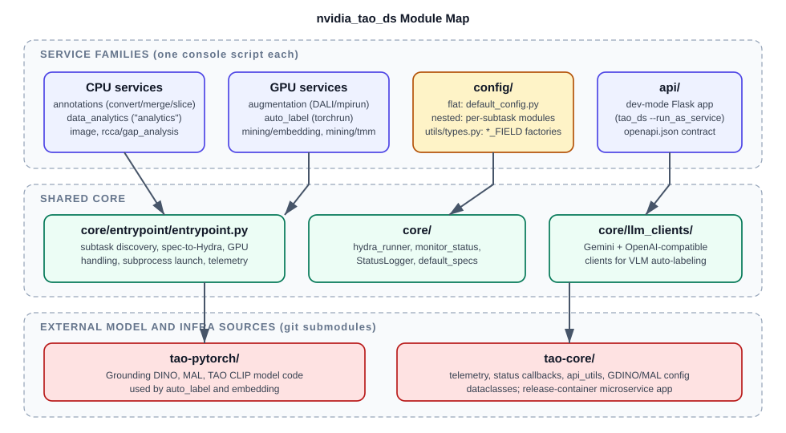

# Codebase Tour

This is a guided walk through the TAO Data Services repository for developers
picking up the codebase for the first time. It answers three questions: what
each directory is for, how the Python package is organized into modules, and
where the sharp edges are. For the runtime and data-flow view, read
[Architecture](architecture.md) next.



## Repository Layout

```text
tao-dataservices/
├── nvidia_tao_ds/            # The installable Python package (everything shipped in the wheel)
│   ├── annotations/          # Format conversion, merge, slice (CPU)
│   ├── augmentation/         # DALI-based data augmentation (GPU, MPI multi-GPU)
│   ├── auto_label/           # Pseudo-label generation: Grounding DINO, MAL, VLM workflows (GPU / remote LLM)
│   ├── data_analytics/       # Dataset analytics, validation, KPI analysis (command name: analytics)
│   ├── image/                # Corrupted-image validation (CPU)
│   ├── mining/               # embedding (CLIP/SigLIP -> parquet) and tmm (RAPIDS nearest-neighbor mining)
│   ├── rcca/                 # gap_analysis: model-failure / coverage analysis
│   ├── core/                 # Shared launcher, Hydra runner, decorators, logging, LLM clients
│   ├── config/               # Hydra dataclass schemas, one package per service
│   ├── api/                  # Dev-mode Flask API (refer to the API section in Architecture)
│   ├── backbone/             # Vendored FAN/ConvNeXt/Swin/ViT code (legacy, unused elsewhere)
│   └── dataclass_to_rst/     # Doc tooling: config dataclasses -> RST tables for public docs
├── runner/tao_ds.py          # Host-side Docker launcher (not shipped in the wheel)
├── scripts/envsetup.sh       # Defines the tao_ds shell function; installs git hooks
├── docker/                   # Base development image: Dockerfile, manifest.json, requirements
├── release/                  # Release image, version metadata (release/python/version.py)
├── internal/                 # Unpackaged dev scripts (dataset split, KITTI visualization)
├── tools/                    # update_readme_supported_commands.py (generates the README command table)
├── tests/                    # pytest suites (flat files + tests/autolabel + tests/mining)
├── docs/                     # This documentation
├── .github/                  # GitHub Actions workflows and shared hook scripts
├── tao-core/                 # Git submodule: shared TAO config/microservice/telemetry code
├── tao-pytorch/              # Git submodule: model code consumed by auto_label and embedding
├── setup.py                  # Package definition and console_scripts (one per service)
└── Makefile                  # Wheel build targets (build, install, develop, clean)
```

The rules of thumb are:

* If it ships to users, it lives under `nvidia_tao_ds/`.
* If it launches or builds containers, it lives in `runner/`, `docker/`, or
  `release/`.
* If it validates the repository, it lives in `tests/`, `.pre-commit-config.yaml`, or
  `.github/workflows/`.

## The Package in One Table

| Module | Role | Key files |
| :--- | :--- | :--- |
| `<service>/entrypoint/` | An approximately 35-line argparse shell delegating to the shared launcher. | For example, `annotations/entrypoint/annotations.py` |
| `<service>/scripts/` | One module per subtask; each owns its `@hydra_runner(...)` declaration. | For example, `annotations/scripts/convert.py` |
| `<service>/experiment_specs/` | Example YAML specifications selected by `-e`. | For example, `annotations/experiment_specs/annotations.yaml` |
| `core/entrypoint/entrypoint.py` | The shared launcher: subtask discovery, spec-to-Hydra translation, GPU handling, subprocess launch, telemetry, and status-based failure detection. | `get_subtasks`, `launch` |
| `core/hydra/hydra_runner.py` | Schema registration and Hydra invocation. | `hydra_runner` decorator |
| `core/decorators.py` | `@monitor_status` (results dir, `status.json`, error classification) and `@experimental`. | |
| `core/logging/` | `StatusLogger`, dual logging into `status.json`. | `logging.py` |
| `core/llm_clients/` | LLM/VLM client abstraction used by auto-label workflows. | `LLMClient` ABC, `GeminiClient`, `OpenAICompatibleClient`, and the `create_client` factory |
| `core/utils/` | `default_specs` pseudo-subtask, shared COCO/KITTI loading, video helpers. | `default_specs.py`, `dataset_loading.py`, `video_utils.py` |
| `config/<service>/` | Dataclass schemas (refer to [Two Configuration Conventions](#two-configuration-conventions)). | `default_config.py` and per-subtask modules |
| `config/utils/types.py` | Typed field factories (`STR_FIELD`, `INT_FIELD`, `DATACLASS_FIELD`, ...) that attach UI/validation metadata. | |
| `api/` | Dev-mode Flask app exposing services as API actions. | `app.py`, `openapi.json` |

## Service Inventory

Each console script (registered in `setup.py`) maps to one service package:

| Command | Package | Subtasks | Runs on |
| :--- | :--- | :--- | :--- |
| `annotations` | `annotations/` | `convert`, `merge`, `slice`, `qa_to_llava_annotation` | CPU |
| `augmentation` | `augmentation/` | `generate` | GPU (DALI; multi-GPU via `mpirun`) |
| `auto_label` | `auto_label/` | `generate` (dispatches on `autolabel_type`) | GPU (`torchrun`) or remote LLM APIs |
| `analytics` | `data_analytics/` | `analyze`, `validate`, `kpi_analyze` | CPU |
| `image` | `image/` | `validate` | CPU |
| `embedding` | `mining/embedding/` | `image_embeddings`, `text_embeddings` | GPU |
| `tmm` | `mining/tmm/` | `nearest_neighbors`, `unique_neighbor_matching` | GPU (RAPIDS `cudf`/`cuml`) |
| `gap_analysis` | `rcca/gap_analysis/` | `object_detection`, `vcn_aoi`, `vlm_bcq` | CPU |

The `auto_label generate` subtask fans out on `cfg.autolabel_type`:

| `autolabel_type` | What it does | Model source |
| :--- | :--- | :--- |
| `grounding_dino` | Text-prompted box pseudo-labels with iterative refinement | Grounding DINO built from the `tao-pytorch` submodule; user-supplied checkpoint |
| `mal` | Box-to-segmentation pseudo-labels | MAL from `tao-pytorch`; PL checkpoint |
| `image_grounding` | VLM two-step expression extraction + grounding | Remote VLM via `core/llm_clients` |
| `image_referring_expression` | VLM four-step referring-expression workflow | Remote VLM |
| `video_reasoning_annotation` | Multi-step video captioning/QA workflow | Remote VLM + LLM |

## Anatomy of One Service: `annotations`

```text
nvidia_tao_ds/annotations/
├── entrypoint/annotations.py     # argparse shell -> core launcher
├── scripts/convert.py            # @hydra_runner(config_name="annotations", schema=ExperimentConfig)
├── scripts/{merge,slice,qa_to_llava_annotation}.py
├── conversion/                   # The format-conversion engine
│   └── mapping.py                # CONVERSION_MAPPING: {input_format: {output_format: converter_fn}}
├── merger.py                     # Merger ABC -> COCOMerger, LLaVAMerger, ODVGMerger
├── slicer.py                     # Slicer ABC -> COCO{Random,Number,Category,Filename}Slicer
└── experiment_specs/*.yaml       # 11 example specs
nvidia_tao_ds/config/annotations/
├── default_config.py             # ExperimentConfig (convert)
├── merge_config.py               # MergeConfig
└── slice_config.py               # SliceConfig
```

Command flow for `annotations convert -e spec.yaml results_dir=/results`:

1. The `annotations` console script calls
   `annotations/entrypoint/annotations.py:main`.
2. `core/entrypoint/entrypoint.py::get_subtasks()` discovers `scripts/*.py` as
   subtasks and injects the synthetic `default_specs` subtask.
3. `launch()` converts `-e` into Hydra `--config-path`/`--config-name` flags,
   passes unknown CLI tokens through as Hydra overrides, and **spawns a fresh
   `python .../scripts/convert.py` subprocess**, teeing stdout (and to
   `$TAO_MICROSERVICES_TTY_LOG/$JOB_ID/microservices_log.txt` when `JOB_ID` is
   set).
4. Inside the child, `@hydra_runner(..., schema=ExperimentConfig)` validates the
   YAML, and `@monitor_status(...)` creates the results directory and writes
   `status.json`.
5. `run_conversion(cfg)` dispatches through
   `CONVERSION_MAPPING[input_format][output_format]`.
6. Back in the parent, failure is detected two ways: the subprocess exit code
   **and** the last record of `results_dir/status.json` — a subtask that exits
   0 but logged `FAILURE` is still reported as failed.

The subprocess step matters for debugging: breakpoints set in a `scripts/*.py`
are never hit when you launch via the console command. Run the script module
directly with `--config-path`/`--config-name` to debug it in-process.

## Two Configuration Conventions

The configuration tree has two generations of layout:

* **Flat (older services):** Schemas live in `config/<service>/`, anchored by
  `default_config.py::ExperimentConfig`: `annotations`, `augmentation`,
  `auto_label`, `image`, and `analytics` (the schema package for
  `data_analytics/`). Subtasks may add sibling modules; `annotations` pairs
  `ExperimentConfig` (convert) with `merge_config.py` and `slice_config.py`.
* **Per-subtask (newer services):** One configuration module per subtask:
  `config/mining/embedding/image_embeddings.py` (`ImageEmbeddingsConfig`),
  `config/mining/tmm/nearest_neighbors.py` (`NearestNeighborsConfig`),
  `config/rcca/gap_analysis/*.py`, and so on.

Fields in both use the factories from `config/utils/types.py`, which attach
`description`, `valid_options`, `valid_min`/`valid_max`, and related metadata
consumed by specification generation and the FTMS/API layer.

## Sharp Edges

The following behaviors surprise every new developer; they are collected in one place:

* **`data_analytics` versus `analytics`.** The package directory is
  `data_analytics/`, the console script is `analytics`, and the configuration package
  is `config/analytics/`. `core/utils/default_specs.py` carries an explicit
  alias map to reconcile them.
* **`default_specs` does not support mining or rcca.** It only recognizes
  services with a flat `nvidia_tao_ds/<dir>/entrypoint/` layout and a
  `config/<dir>/default_config.py`. The nested `mining/*` and `rcca/*` services
  fail with "Module ... is not supported" even though `default_specs` appears
  in their subtask lists.
* **Every command requires `nvidia-smi`**, including pure-CPU ones — the shared
  launcher unconditionally counts GPUs. The CLI cannot run on a GPU-less host.
* **Multi-GPU parsing is keyed on the literal subtask name `generate`.**
  `launch(multigpu_support=['generate'], ...)` — a new GPU subtask with any
  other name silently runs single-GPU and ignores spec-level
  `num_gpus`/`gpu_ids`. `augmentation` uses `mpirun`, `auto_label` uses
  `torchrun`; the choice is keyed on the `network=` string.
* **Not every subtask writes `status.json`.** `@monitor_status` is present on
  annotations `convert`/`merge`/`slice`, `augmentation generate`,
  `auto_label generate`, analytics `analyze`/`validate`, and `image validate`
  — and absent on `qa_to_llava_annotation`, `kpi_analyze`, all of `mining/*`,
  and all of `rcca/*`. For the latter group the launcher's status-based
  failure check is a no-op.
* **`augmentation`'s default `config_name` is `"kitti"`**, not `generate`; its
  `experiment_specs/` holds `kitti.yaml` and `coco.yaml`. Always read the
  `@hydra_runner(config_name=...)` line rather than inferring from the subtask
  name.
* **`vllm_captioning` is a dangling auto-label option.** It appears in the
  configuration's `valid_options`, but `ExperimentConfig` has no such field and
  the script raises `NotImplementedError`; selecting it fails with an
  `AttributeError` from configuration validation.
* **`nvidia_tao_ds/backbone/` is vendored legacy code** (FAN/ConvNeXt/Swin/ViT;
  the FAN-derived files carry an additional NVlabs Source Code License-NC
  notice) imported by nothing else in the package. Do not extend it.
* **The Docker image enforces a codec policy.** The base image builds an
  LGPL-only FFmpeg (VP9/mjpeg encode only; H.264 decode is hardware-only) and
  OpenCV without FFmpeg, with build-time assertions that fail the image if
  restricted codecs reappear. Any video-handling change must stay inside that
  allow-list (`core/utils/video_utils.py` uses `libvpx-vp9`).
* **Two API stories exist.** `nvidia_tao_ds/api/app.py` is a dev-mode Flask app
  reachable only via `tao_ds --run_as_service`; the release container instead
  runs the tao-core microservice app. Refer to [Architecture](architecture.md).
* **No pytest configuration file exists.** There is no `conftest.py` or
  `pytest.ini`; several GPU/data-heavy tests skip themselves when
  `CI_PROJECT_DIR` is set (a GitLab-era guard) and need private scratch
  datasets mounted. Prefer path-based test selection.
