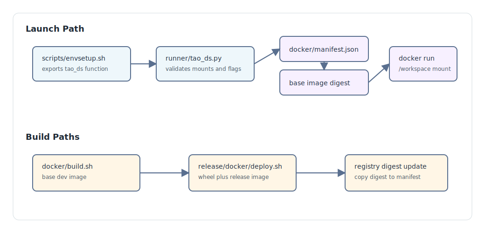

# Container Power Users

The `tao_ds` launcher is a host-side convenience wrapper around Docker. It is
defined by `scripts/envsetup.sh` and implemented by `runner/tao_ds.py`.



## Launcher Lifecycle

1. `source scripts/envsetup.sh` sets `NV_TAO_DS_TOP`.
2. The shell function `tao_ds` runs `python $NV_TAO_DS_TOP/runner/tao_ds.py`.
3. The runner loads `docker/manifest.json`.
4. It chooses the x86 digest on `x86_64`, the ARM digest on `aarch64`, and x86
   as a fallback for unknown architectures.
5. It checks for a local image or pulls the registry, repository, and
   architecture-specific digest from `docker/manifest.json`.
6. It starts Docker with `/workspace` mounted from the source checkout and
   `PYTHONPATH=/workspace:$PYTHONPATH`.

Commands after `--` run inside the container:

```sh
tao_ds --gpus all -- make build
tao_ds --gpus all -- annotations convert -e nvidia_tao_ds/annotations/experiment_specs/annotations.yaml
```

## Mounts

`tao_ds` always mounts the source tree to `/workspace`. Additional mounts can
come from `~/.tao_mounts.json`, a custom `--mounts_file`, or repeated
`--volume` flags.

Example mounts file:

```json
{
  "Mounts": [
    {
      "source": "/data/tao",
      "destination": "/data"
    },
    {
      "source": "/results/tao-ds",
      "destination": "/results"
    }
  ]
}
```

The runner validates that host-side mount sources exist before Docker starts.

## GPUs And Runtime

`--gpus all` is the default. On Docker API versions newer than `1.40`, the
runner uses Docker's `--gpus` flag. On older Docker versions or Tegra systems,
it falls back to `--runtime=nvidia` and `NVIDIA_VISIBLE_DEVICES`.

Inside command launch, `nvidia_tao_ds/core/entrypoint/entrypoint.py` reads
`num_gpus`, `gpu_ids`, and `cuda_blocking` from command-line Hydra overrides
first, then from the experiment spec. It sets `TAO_VISIBLE_DEVICES` for all
launches and `CUDA_VISIBLE_DEVICES` for multi-GPU augmentation or auto-label
paths.

## UID, Shared Memory, Ulimits, And TTY

Useful launcher flags:

| Flag | Use |
| :--- | :--- |
| `--run_as_user` | Run the container as the host UID/GID so generated files are not root-owned. |
| `--shm_size 30G` | Increase shared memory for heavy data and model workflows. |
| `--ulimit memlock=-1 --ulimit stack=67108864` | Match release-container run settings for memory-sensitive workloads. |
| `--no-tty` | Run without `-it`, useful for automation. |
| `--tag $USER` | Use a locally built base image tag instead of the manifest digest. |

## Direct Docker Shape

The runner prints the final Docker command before executing it. A simplified
equivalent looks like:

```sh
IMAGE="$(jq -r '.registry + "/" + .repository + "@" + .digests.x86' docker/manifest.json)"
docker run -it --rm \
  --gpus all \
  -v "$NV_TAO_DS_TOP:/workspace" \
  -v /data/tao:/data \
  -e PYTHONPATH=/workspace:$PYTHONPATH \
  --shm-size 16G \
  -w /workspace \
  --net=host \
  "$IMAGE" \
  /bin/bash -c "make build"
```

Use the architecture digest from `docker/manifest.json` for direct Docker runs.

## Service Mode

`tao_ds --run_as_service` builds a command that installs the packaged
`nvidia_tao_pytorch` wheel, builds the Data Services wheel, points Flask at
`nvidia_tao_ds/api/app.py`, and runs Flask on the requested host and port. The
service uses host networking by default and can add a port mapping through
`--port_mapping` and `--port`.

Check `nvidia_tao_ds/api/app.py` for available API routes and
`nvidia_tao_ds/api/openapi.json` for the generated API contract.

## Base Image Builds

Use the base-image build script in `docker/`:

```sh
cd "$NV_TAO_DS_TOP/docker"
./build.sh --build --x86
./build.sh --build --arm
./build.sh --build --multiplatform --push
```

The script tags local single-platform builds as `$USER`. Pushed builds receive a
timestamped tag and print the digest that should be copied into
`docker/manifest.json`.

## Release Image Builds

Use the release build script in `release/docker/`:

```sh
cd "$NV_TAO_DS_TOP/release/docker"
./deploy.sh --build --wheel
```

The release image builds on the base Data Services image, installs the
`nvidia_tao_ds` wheel, and can push `nvcr.io/nvstaging/tao/tao-toolkit-ds:<tag>`
when run with `--push`.
